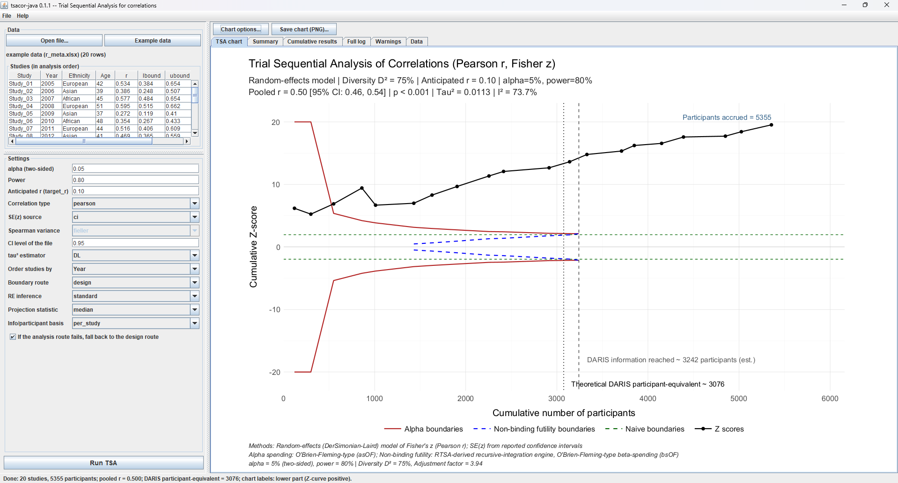

# tsacor-java — Trial Sequential Analysis for meta-analyses of correlations (Java edition of tsacor)

[](https://github.com/tarak-dhaouadi/tsacor-java/actions/workflows/check.yaml)
[-blue.svg)](LICENSE.md)
[](https://adoptium.net/)

A stand-alone desktop and command-line application, **no R needed**, that runs the same analysis as
**`tsa_cor()`** in the R package [tsacor](https://github.com/tarak-dhaouadi/tsacor)

* Graphical application (Swing) and command-line interface, one self-contained `.jar`.
* Reads `.xlsx` (first sheet) and `.csv` files; no external libraries.
* Shows the studies in analysis order next to the settings, so you can check the data and the sort order before running.
* Exports the TSA chart (PNG at 150, 300, 600 or 1200 dpi), the summary table, the cumulative results and the
  boundaries (CSV), and a full text report.



## Run it

Requires only a Java runtime (11 or later):

1. Download `tsacor-java-0.1.1.jar` from the
   [Releases](https://github.com/tarak-dhaouadi/tsacor-java/releases) page.
2. Double-click the JAR, or run:

```
java -jar tsacor-java-0.1.1.jar
```

In the application: **Open file…** (or **Example data**), check the studies in the *Studies (in analysis order)* table, choose the settings, press **Run TSA**.
The boundary computation takes a few seconds.

### Command line

```
java -jar tsacor-java-0.1.1.jar --cli data.xlsx --target-r 0.10 --order-by Year \
     --png tsa_plot.png --summary-csv summary.csv --cumulative-csv cumulative.csv
java -jar tsacor-java-0.1.1.jar --cli --example --target-r 0.10 --order-by Year --route analysis
java -jar tsacor-java-0.1.1.jar --help
```

Option names follow `tsa_cor()`: `--alpha`, `--power`, `--target-r`, `--cor-type`, `--se-source`,
`--spearman-variance`, `--ci-level`, `--method`, `--order-by`, `--route` (design | analysis),
`--re-inference`, `--projection-stat`, `--ipp-basis`.

## Data format

One row per study, header row, columns (names are matched exactly; spaces become underscores):

| Column       | Meaning                                                                         |
|--------------|---------------------------------------------------------------------------------|
| `Study`      | unique study label                                                              |
| `r`          | Pearson r or Spearman rho of the study (strictly between -1 and 1)              |
| `n_subjects` | number of subjects (whole number, greater than 3)                               |
| `lbound`, `ubound` | limits of the study's confidence interval (needed for `SE source = ci`, the default) |

Other columns (e.g. `Year`) are kept and can be used to sort the studies. TSA is order-dependent:
sort chronologically. The bundled example (20 studies, 2005–2024) is the R package's `r_meta.xlsx`.

## Chart: placement of the DARIS labels

The four DARIS labels (theoretical DARIS participant-equivalent, DARIS information reached,
historical-rate projection, analysis-route endpoint) are placed according to the sign of the
Z-curve (its last cumulative Z-score):

* **Z-curve positive** → the four labels sit in the **lower** part of the chart and the
  "Participants accrued" label sits **just above the end of the Z-curve**;
* **Z-curve negative** → the four labels stay in the **upper** part and "Participants accrued"
  stays at the bottom.

*Chart options…* can force *upper* or *lower*. On the command line: `--labels auto|upper|lower`.
The same behaviour for the R package is in `tsacor_daris_labels.patch` (new argument `daris_labels`; written without an R session at hand, so run `devtools::check()` before using it).

## What is (and is not) ported

Ported from tsacor 0.1.0: data validation; random-effects meta-analysis of Fisher's z (tau² estimators
DL, HE, HS, HSk, SJ, ML, REML, EB, PM, PMM; standard and HKSJ / ad hoc HKSJ inference); Diversity (D²)
adjustment; RIS and DARIS (Pearson, and Spearman with the Fieller or Bonett-Wright variance factor);
cumulative Z-curve; O'Brien-Fleming-type alpha/beta-spending boundaries from the RTSA engine, both the
**design** and **analysis** routes; decision logic; retrospective projection of additional
participants/studies; summary table; the TSA chart.

Differences from the R package, by design:

* **No legacy fallback engine.** The R package can fall back to an approximate pure-R engine
  (`legacy_fallback = TRUE`) when the RTSA-derived engine fails. The Java app never substitutes a
  non-RTSA-comparable result: it stops with an explanation (the R option `legacy_fallback = FALSE`).
  If the *analysis* route fails it can fall back to the design route (checkbox / `--no-fallback`).
* The tau² estimators `GENQ`/`GENQM` are not offered (as in R, they need user weights).
* `.xlsx` reading uses the JDK's own zip/XML parsers (first sheet, cached values); formulas
  are read as the values Excel stored.

## Validation

`SelfTest` (see the count printed by `./build.sh --test`; run by `./build.sh --test`) compares the engine with the numbers printed by
**live RTSA 0.2.2** (`rtsa_0.2.2_reference.R`: design root 1.1332419034834, alpha and beta bounds, spending,
analysis route; agreement 1e-14 or better), the statistics layer with the reference values
in tsacor's own tests (pooled r, Q, I², D², adjustment factor, RIS, DARIS), the tau² estimators and the HKSJ
quantities with independent SciPy computations, plus input validation, file readers and the label placement.

The graphical front end is plain Swing on top of the tested core. It was laid out and rendered off-screen in the
build environment (no desktop available there), so please report anything odd you see on your machine.

## Build

```
./build.sh --test        # Linux / macOS, needs a JDK 11+ (javac, jar); no Maven, no downloads
build.bat --test         # Windows
mvn package              # alternative, if you use Maven
```

## Licence and attribution

GPL-2.0-or-later (see `LICENSE.md`, `COPYRIGHTS.md`), as tsacor and RTSA. Contains code ported from RTSA
(Anne Lyngholm Soerensen, Markus Harboe Olsen, Theis Lange, Christian Gluud), the R version of the
Copenhagen Trial Unit's TSA software (<https://ctu.dk/tools>). If you use it for boundary computations,
please cite RTSA and TSA, and Wetterslev J, Thorlund K, Brok J, Gluud C. *BMC Med Res Methodol.*
2009;9:86.
